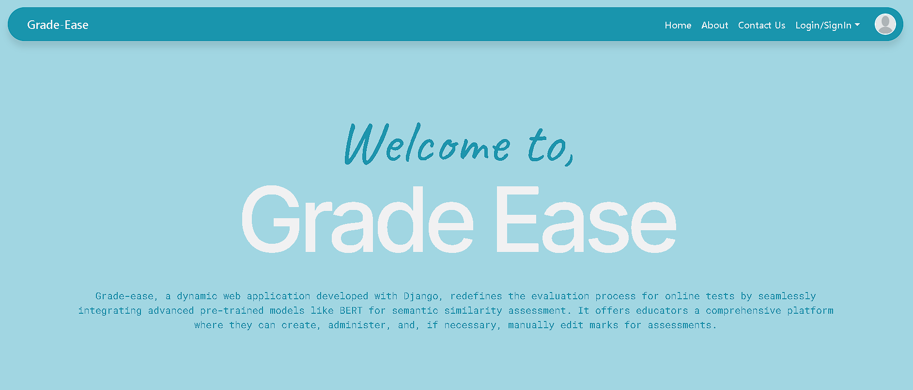

# GradeEase

## Overview

GradeEase is a web-based application developed as a final year project designed to automate the evaluation of students' answers and assign grades. The system assesses both online tests and handwritten answer sheets using semantic similarity, keywords, and word count. It employs a pre-trained BERT model for semantic similarity calculations and utilizes the Gemini API to extract text from handwritten papers.

## Features

- **Automated Grading:** Evaluates answers based on semantic similarity with the pre-trained BERT model.
- **Versatile Input:** Supports online tests and handwritten answer sheets.
- **Text Extraction:** Uses Gemini API for converting handwritten answers into text.
- **Front-End:** Built with HTML, CSS, and JavaScript.
- **Back-End:** Powered by Django Framework.
- **Manual Adjustment:** Teachers can manually edit grades if needed.
- **Productivity Enhancement:** Speeds up the grading process and increases efficiency.

## Technical Details

- **Semantic Similarity:** Uses BERT model for accurate grading.
- **Text Retrieval:** Gemini API for text extraction from handwritten papers.
- **Web Technologies:** HTML, CSS, JavaScript for front-end; Django for back-end.
- **Machine Learning & NLP:** Incorporates machine learning models and Natural Language Processing.

## Learning Outcomes

- Gained experience with the Django Framework and web development.
- Deepened understanding of machine learning models and NLP.
- Explored generative AI and integrated ML models from Hugging Face.
- Learned to combine machine learning with Django for practical applications.

## Setup

1. **Clone the Repository:**
   ```bash
   git clone https://github.com/Sanjo17/Grade_Ease_AI-Assisted-Evaluation.git
   ```

2. **Install Dependencies:**
   ```bash
   cd gradeease
   pip install -r requirements.txt
   ```

3. **Run Migrations:**
   ```bash
   python manage.py migrate
   ```

4. **Start the Development Server:**
   ```bash
   python manage.py runserver
   ```

5. **Access the Application:**
   Open `http://127.0.0.1:8000/` in your web browser.
   

6. **Create a .env file :**
   create a .env file and add the api key.

## Images

Here are some screenshots of the GradeEase application:

1. **Homepage:**
   

2.**Text Extraction Interface:**
   
   
3. **Evaluation Results:**
   


